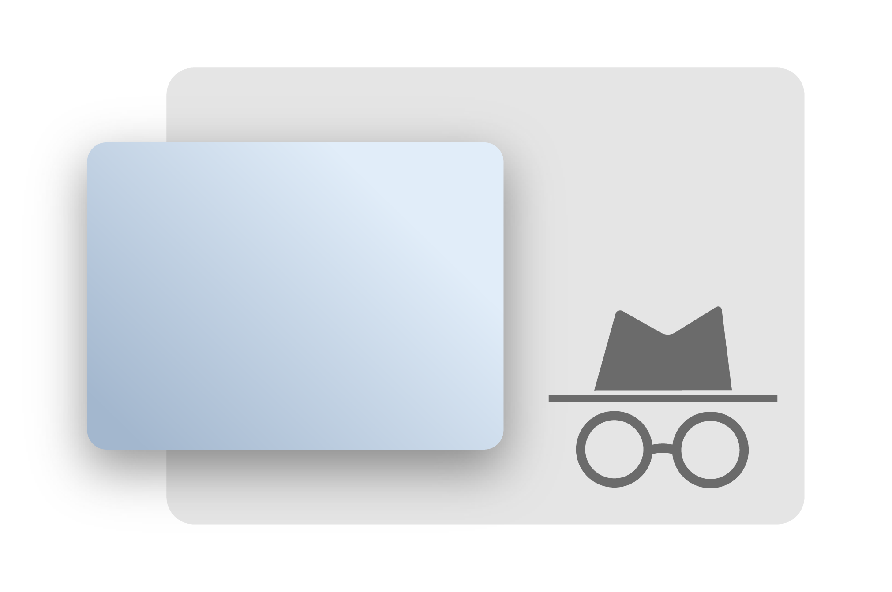

  

<h1 align="center">FocusPrivacy</h1>

  FocusPrivacy is a browser extension that prevents websites from knowing if the window loses focus.

## Plug And Play
Once installed, the extension begins working! 

To disable or enable it, go to `chrome://extensions` and toggle the switch for FocusPrivacy.
